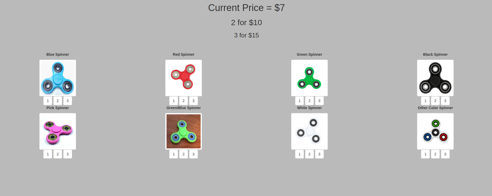

# PythonGoreanTheorem

## Flask-Based inventory management system I created for a local flea market business where I sold Fidget Spinners.

<p align="center">
  
</p>

### Getting Started

Install requirement by running:

```pip install -r requirements.txt```

After installing all requirements, simply run the command:

```python app.py```

And then navigate your browser to the following address:

```127.0.0.1:5000```